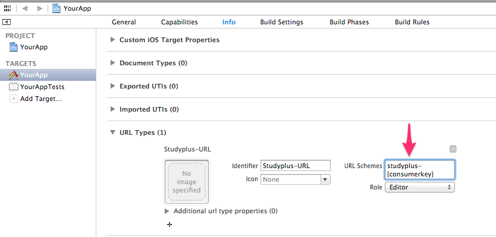

StudyplusSDK
=======

Studyplus iOS SDK

## Requirements

 * iOS 6.0 or above
 * Xcode command line tools
 * ARC
 * [Studyplus iOS App 3.10.0 or adove](https://itunes.apple.com/jp/app/mian-qiangga-leshiku-xuku!/id505410049?mt=8)
 * CocoaPods
 
## Dependency
 * [UICKeyChainStore](https://github.com/kishikawakatsumi/UICKeyChainStore)

## Install

### With CocoaPods

```
platform :ios, '6.0'
pod 'StudyplusSDK', :git => 'https://github.com/studyplus/Studyplus-iOS-SDK.git'
```

### Without CocoaPods

coming soon

## Usage

### Set up custom URL schema

set "studyplus-*{your consumer key}*" to URL Types.



### Initialize

```Objective-C
#import "Studyplus.h"

static NSString * const ConsumerKey = @"Your Studyplus consumer key";
static NSString * const ConsumerSecret = @"Your Studyplus consumer secret";

@implementation YourClass
{
    Studyplus *studyplus;
}

-(id) init {

    if (self = [super init]) {
        studyplus = [Studyplus studyplusWithConsumerKey:ConsumerKey
                                      andConsumerSecret:ConsumerSecret];
        studyplus.delegate = self;
    }
    return self;
}
```

### Auth or Login 

```Objective-C
@implementation YourClass

-(void) auth {
    [studyplus auth];
}

-(void) login
{
    [studyplus login];
}

-(void)studyplusDidConnect:(Studyplus*)studyplus
{
    NSLog(@"Auth or Login succeeded");
}

-(void)studyplusDidFailToConnect:(Studyplus*)studyplus withError:(NSError*)error
{
    NSLog(@"Auth or Login failed");
}

- (void)studyplusDidCancel:(Studyplus*)studyplus
{
    NSLog(@"Auth or Login canceled");
} 
```

### Post study record to Studyplus

```Objective-C
-(void)post
{
    NSUInteger pages = 100;

    // Create new study record.
    StudyplusRecord *studyplusRecord =
      [StudyplusRecord
       recordWithDuration:record.duration
       options:@{
           @"recordedAt" : [NSDate date],
           @"comment" : @"アプリ◯◯で勉強しました！！",
           @"amount" : [StudyplusRecordAmount amount:pages],
      }];

    // post
    [studyplus postStudyRecord:studyplusRecord];

}

-(void)studyplusDidPostStudyRecord:(Studyplus*)studyplus
{
    NSLog(@"Post to Studyplus succeeded");
}

-(void)studyplusDidFailToPostStudyRecord:(Studyplus*)studyplus withError:(NSError*)error
{
    NSLog(@"Post to Studyplus failed");
}
```

### More info about SDK interface

 * StudyplusSDK/Classes/Studyplus.h
 * StudyplusSDK/Classes/StudyplusDelegate.h
 * StudyplusSDK/Classes/StudyplusRecord.h
 * StudyplusSDK/Classes/StudyplusRecordAmount.h

## License

[MIT License.](http://opensource.org/licenses/mit-license.php)
